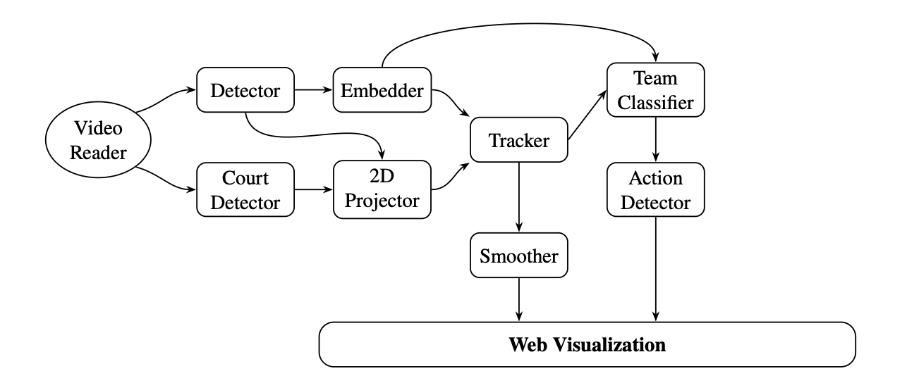
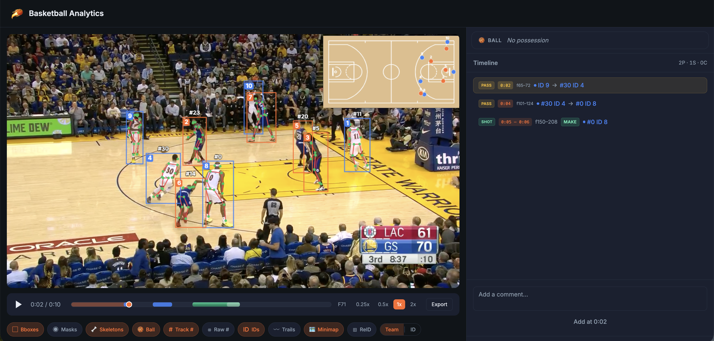

# Basketballs — Automatic Basketball Match Analysis

[]()
[]()
[]()
[]()
[]()

---

## Overview

This project implements an automatic basketball match analysis system based on computer vision techniques. The system processes a single broadcast-style video stream and extracts structured information about the game.

The pipeline includes detection, tracking, spatial reconstruction, and high-level event recognition such as passes and shots. The result is a functional prototype that can support research in sports analytics, coaching tools, and enhanced broadcast visualization.

---

## System Architecture



*Figure: System pipeline overview.*

---

## Components

| Component         | Description                                                                                                                   |
| ----------------- | ----------------------------------------------------------------------------------------------------------------------------- |
| Video Reader      | Reads input video and feeds frames into the pipeline sequentially.                                                            |
| Court Detector    | Detects court keypoints and lines to establish scene geometry, enabling mapping from image space to court coordinates.        |
| 2D Projector      | Applies the homography estimated by the Court Detector to convert image-space player positions to top-down court coordinates. |
| Detector          | Detects all players and the ball in each frame, producing bounding boxes and confidence scores.                               |
| Embedder          | Extracts appearance embeddings from detected bounding boxes to support re-identification across frames.                       |
| Tracker           | Associates detections across frames to maintain consistent player tracks and IDs, using both motion and appearance cues.      |
| Smoother          | Applies post-processing to tracking trajectories to reduce noise and temporal jitter.                                         |
| Team Classifier   | Assigns each tracked player to one of the two teams based on appearance features.                                             |
| Action Detector   | Recognizes basketball events (e.g., passes, shots) from tracking data and visual features.                                    |
| Web Visualization | Renders outputs in an interactive web interface, including annotated video, minimap, and event timeline.                      |

---

## Example Output



---

## Contributions

| Author  | Contributions                                                                                                                  |
| ------- | ------------------------------------------------------------------------------------------------------------------------------ |
| Evgenii | Tracker, Embedder, Team Assignment, Trajectory Smoothing                                                                       |
| Alexey  | Multi-class Detector, Skeleton Estimation, Jersey Number Recognition, Number-to-Player Assignment, Possession & Pass Detection |
| Anton   | Ball Detector, Court Detection, Shot Detection                                                                                 |
| All     | Web Interface                                                                                                                  |

---

## Demo

Demo is available at [https://demo.basketballsproject.com](https://demo.basketballsproject.com)

---

## Installation

### Python Dependencies

```bash
pip3 install -r requirements.txt
```

### Node.js (via nvm)

```bash
curl -o- https://raw.githubusercontent.com/nvm-sh/nvm/v0.39.7/install.sh | bash
source ~/.bashrc   # or ~/.zshrc

nvm install 20
nvm use 20

node --version
```

### System Dependencies

```bash
sudo apt-get install -y libgl1
```

---

## Running the Project

```bash
./components/web/dev.sh
```

---

## Troubleshooting

### npm Conflicts

```bash
cd components/web/frontend
rm -rf node_modules package-lock.json
npm install
```

### Backend Process Still Running

```bash
lsof -i :8000 # look for running processes
kill -9 <pid>
```

---

## Self-Hosting with Nginx

```nginx
location / {
    proxy_pass http://localhost:5173;
    proxy_http_version 1.1;
    proxy_set_header Upgrade $http_upgrade;
    proxy_set_header Connection "upgrade";
    proxy_set_header Host localhost;
}
```

---

## License

Creative Commons Attribution-NonCommercial 4.0 International (CC BY-NC 4.0)

---

## Legal Notice

The models, datasets, and associated materials (the “Materials”) are provided for limited, non-commercial research, educational, and academic use only.

The dataset includes 16 NBA video clips, each approximately 7–11 seconds long, annotated with player tracking data and detections for benchmarking and evaluation.

By using the Materials, you agree to the following:

* The Materials may not be used for commercial or public distribution purposes
* Redistribution to third parties is not permitted
* Use must comply with applicable laws and intellectual property rights
* No ownership of underlying video content is transferred

The Materials are provided "as is", without warranties of any kind. The authors disclaim all liability for damages arising from their use.

---

## Future Work

* **Court Detection**
  Transition to heatmap-based approaches with grid keypoints (similar to KaliCalib) is currently limited by the lack of homography annotations for NBA courts.

* **Possession Detection**
  Replace heuristic methods with sequential models (e.g., LSTM or Transformer) to capture long-term temporal dependencies and produce consistent possession trajectories.

* **Shot Detection**
  Incorporate visual context by cropping the hoop region and processing it with a pretrained CNN (e.g., ResNet), combined with MS-TCN embeddings to improve recognition of ambiguous shots.

* **Motion Prediction**
  Forecast optimal player trajectories using multi-agent interaction modeling, with potential applications for training and decision support.

* **LLM-based Commentary**
  Aggregate pipeline outputs (events, trajectories, possession) and generate natural-language commentary using a fine-tuned language model (e.g., LLaMA-3).
